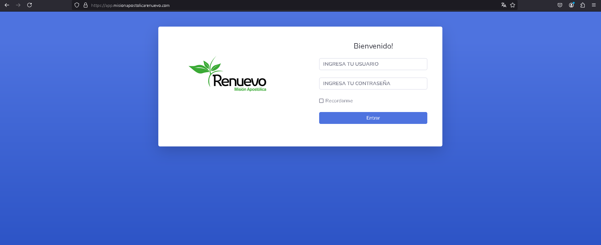
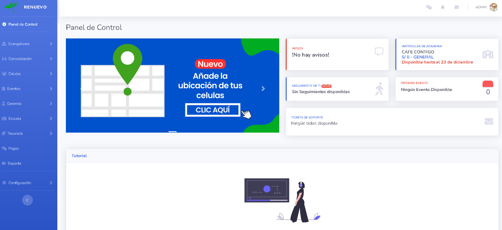

# Mis Proyectos

## Proyecto 1: Renuevo App
Este proyecto es una aplicación integral para una iglesia diseñada para mejorar la gestión de actividades, eventos, y la participación de los miembros de la congregación. La app está pensada para ser una solución completa que centralice las operaciones de la iglesia, facilitando la comunicación entre los líderes y los fieles, además de mejorar la experiencia de asistencia tanto en línea como presencial.



**Descripción:**

Algunas funcionalidades principales que incluye 

### 1. Agenda de Eventos y Servicios
- **Calendario interactivo** que muestra servicios semanales, eventos especiales y reuniones.
- **Notificaciones automáticas** para recordar eventos próximos.
- 
### 2. Gestión de Miembros
- Registro y seguimiento de nuevos miembros.
- Perfiles personalizados con roles y preferencias de comunicación.

### 3. Grupos Pequeños y Ministerios
- Herramientas para **creación y gestión** de grupos pequeños y ministerios.
- Control de asistencias a grupos pequeños o cultos.

### 4. Directorio Celular
- Herramientos para visualizar la ubicación de las reuniones que se realizan.

### 8. Aplicación Móvil
- **Compatibilidad Android**.
- **Diseño responsivo** para una experiencia óptima en diferentes dispositivos.

### 12. Reportes Personalizados
- **Generación de reportes** detallados sobre la asistencia a eventos, donaciones, y actividades de los miembros.
- **Filtros avanzados** para personalizar los informes por fecha, tipo de evento, ministerio, u otros parámetros.
- **Exportación** de reportes en formatos PDF y Excel para compartir con el liderazgo de la iglesia o archivarlos.

## Tecnologías Utilizadas
- **Backend**: PHP, Node.js o Python.
- **Frontend**: React, Angular o Vue.js.
- **Mobile**: Flutter o React Native para iOS y Android.
- **Transmisión en Vivo**: YouTube Live, Facebook Live o RTMP.
- **Notificaciones Push**: Firebase.

## Tecnologías Utilizadas

- **Backend**:
  
  
  

- **Frontend**:
  

- **Notificaciones Push**:
  


## Imágenes

- **Login**  
  
  PHP es un lenguaje de scripting ampliamente utilizado para el desarrollo web.

- **Dashboard**  
  
  Node.js permite ejecutar JavaScript en el servidor.


## Proyecto 2: [Nombre del Proyecto 2]


**Descripción:**

Este es un [descripción breve del proyecto]. Ofrece las siguientes funcionalidades principales:

- Funcionalidad 1: [Descripción breve de la funcionalidad]
- Funcionalidad 2: [Descripción breve de la funcionalidad]
- Funcionalidad 3: [Descripción breve de la funcionalidad]

**Tecnologías utilizadas:**
- [Tecnología 1]
- [Tecnología 2]
- [Tecnología 3]

---

### Cómo ejecutar los proyectos

1. Clona los repositorios:
    ```bash
    git clone https://github.com/usuario/proyecto1.git
    git clone https://github.com/usuario/proyecto2.git
    ```

2. Sigue las instrucciones en cada carpeta del proyecto para ejecutar la aplicación.

