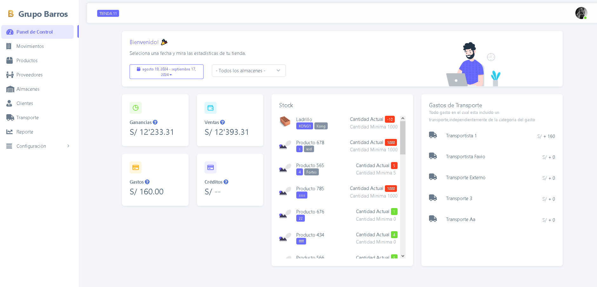
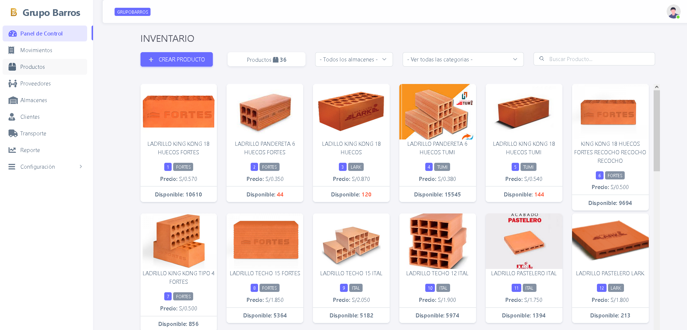

# Mis Proyectos

## Proyecto 1: Renuevo App 

Este proyecto es una aplicación integral para una iglesia diseñada para mejorar la gestión de actividades, eventos, y la participación de los miembros de la congregación. La app está pensada para ser una solución completa que centralice las operaciones de la iglesia, facilitando la comunicación entre los líderes y los fieles, además de mejorar la experiencia de asistencia tanto en línea como presencial.

**Descripción:**

Algunas funcionalidades principales que incluye 

### 1. Agenda de Eventos y Servicios  📆
- **Calendario interactivo** que muestra servicios semanales, eventos especiales y reuniones.
- **Notificaciones automáticas** para recordar eventos próximos.

### 2. Gestión de Miembros 👥
- Registro y seguimiento de nuevos miembros.
- Perfiles personalizados con roles y preferencias de comunicación.

### 3. Grupos Pequeños y Ministerios ⛪
- Herramientas para **creación y gestión** de grupos pequeños y ministerios.
- Control de asistencias a grupos pequeños o cultos.

### 4. Directorio Celular 🗺️
- Herramientos para visualizar la ubicación de las reuniones que se realizan.

### 8. Aplicación Móvil 📱
- **Compatibilidad Android**.
- **Diseño responsivo** para una experiencia óptima en diferentes dispositivos.

### 12. Reportes Personalizados 📊
- **Generación de reportes** detallados sobre la asistencia a eventos, donaciones, y actividades de los miembros.
- **Filtros avanzados** para personalizar los informes por fecha, tipo de evento, ministerio, u otros parámetros.
- **Exportación** de reportes en formatos PDF y Excel para compartir con el liderazgo de la iglesia o archivarlos.

## Tecnologías Utilizadas
- **Backend**: PHP, Node.js o Python.
- **Frontend**: React, Angular o Vue.js.
- **Mobile**: Flutter o React Native para iOS y Android.
- **Transmisión en Vivo**: YouTube Live, Facebook Live o RTMP.
- **Notificaciones Push**: Firebase.

## Tecnologías Utilizadas

  
  
  
  
  
  
  
  

## Imágenes

- **Login**  
  

- **Dashboard**  
  

- **Seguimiento**  
  

- **Reuniones o Celulas**  
  

- **Asistencias**  
  
  
- **Eventos**  
  

- **Directorio Celular**  
  

- **Aplicación Movil**  
  

- **Reporte**  
  

## Proyecto 2: Grupo Barros  

## Descripción

Esta aplicación está diseñada para gestionar una tienda física que vende productos en su local. La aplicación permite a los empleados administrar inventario, realizar ventas y gestionar información de clientes y proveedores. Está orientada a mejorar la eficiencia operativa de la tienda y facilitar el seguimiento de ventas y productos.

### Características Principales

- **Catálogo de Productos** 📦
- Visualiza y busca productos por categoría, precio y popularidad.
- **Proceso de Compra** 🛒
- Realiza compras con opciones de pago seguras y fáciles de usar.
- **Gestión de Usuarios** 👥
- Registra y autentica usuarios, gestiona perfiles y preferencias.
- **Panel de Administración** 🏢
- Administra productos, gestiona pedidos y usuarios desde un panel intuitivo.
- **Reportes Personalizados** 📊
- Genera reportes detallados sobre ventas, usuarios y productos.

## Tecnologías Utilizadas

  
  
  
  
  
  
  
  

## Imágenes

- **Login**  
  

- **Dashboard**  
  

- **Productos**  
  

- **venta**  
  

- **Ticket**  
  
  
- **Aplicacion Movil**  
  

